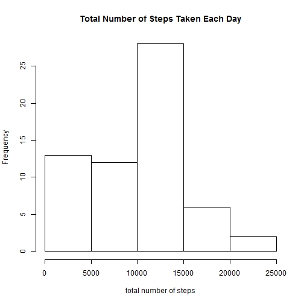
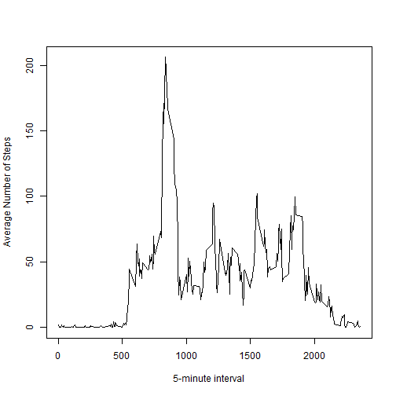
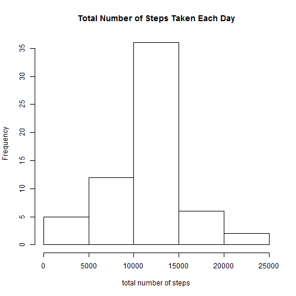
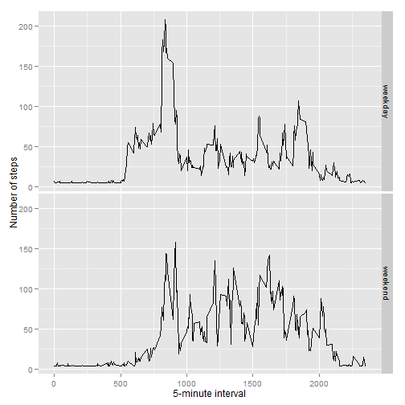

## Loading and preprocessing the data

```r
data = read.table("activity.csv", header=TRUE, sep=",")
```

## What is mean total number of steps taken per day?

```r
dailysteps = tapply(data$steps, data$date, sum, na.rm=TRUE)
hist(dailysteps, xlab = "total number of steps", main="Total Number of Steps Taken Each Day")
```

 

```r
mean(dailysteps)
```

```
## [1] 9354.23
```

```r
median(dailysteps)
```

```
## [1] 10395
```


## What is the average daily activity pattern?

```r
averagesteps = tapply(data$steps, data$interval, mean, na.rm=TRUE)
plot(row.names(averagesteps), averagesteps, xlab = '5-minute interval', ylab = 'Average Number of Steps', type = 'l')
```

 

```r
names(which.max(averagesteps))
```

```
## [1] "835"
```


#### Imputing missing values
#### Total number of missing values in the dataset is:

```r
sum(!complete.cases(data))
```

```
## [1] 2304
```

#### The strategy is to replace all missing values in the dataset with the mean of the 5-min interval


```r
newdata = data

newdata[is.na(newdata)] = mean(averagesteps)

totalsteps = tapply(newdata$steps, newdata$date, sum)
hist(totalsteps, xlab = "total number of steps", main="Total Number of Steps Taken Each Day")
```

 

```r
mean(totalsteps)
```

```
## [1] 10766.19
```

```r
median(totalsteps)
```

```
## [1] 10766.19
```
#### these values are higher than in the first part of the assignment. This is because inputing values in place of NA has increased the mean and median total number of daily steps.


## Are there differences in activity patterns between weekdays and weekends?


```r
library(ggplot2)
```

```
## Warning: package 'ggplot2' was built under R version 3.1.2
```

```
## Need help? Try the ggplot2 mailing list: http://groups.google.com/group/ggplot2.
```

```r
library(knitr)

dayoftheweek = function(date) 
{
    day = weekdays(date)
    if (day %in% c("Saturday", "Sunday"))
        return("weekend")
    else return("weekday")
    
}
newdata$date = as.Date(newdata$date)
newdata$day = sapply(newdata$date, FUN=dayoftheweek)


averages = aggregate(steps ~ interval + day, data=newdata, mean)
ggplot(averages, aes(interval, steps)) + geom_line() + facet_grid(day ~ .) + xlab("5-minute interval") + ylab("Number of steps")
```

 
